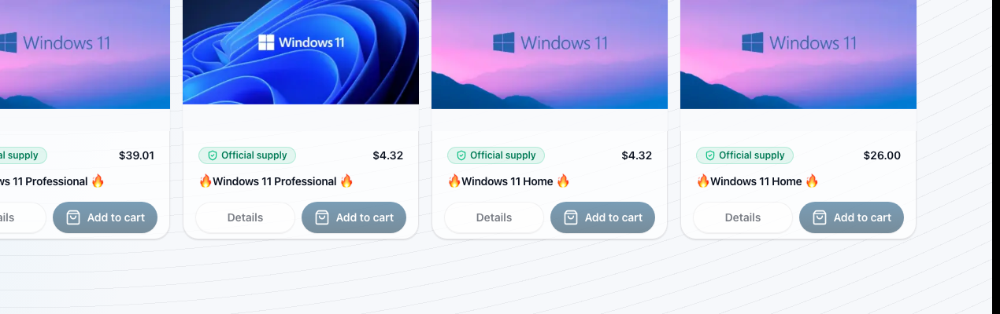

# Корзина

Корзина используется для подготовки списка товаров перед оформлением заказа.

## Элементы интерфейса

Добавление товара выполняется через кнопку `Add to cart` на карточке товара.
В верхней панели отображается значок корзины, через который пользователь
переходит к списку выбранных товаров.

## Действия пользователя

1. Добавить товар из каталога или карточки товара.
2. Открыть страницу корзины.
3. Изменить количество товара при необходимости.
4. Удалить лишний товар.
5. Проверить итоговую сумму.
6. Перейти к оформлению заказа.

Если корзина пустая, система отображает сообщение и предлагает вернуться в
каталог.
