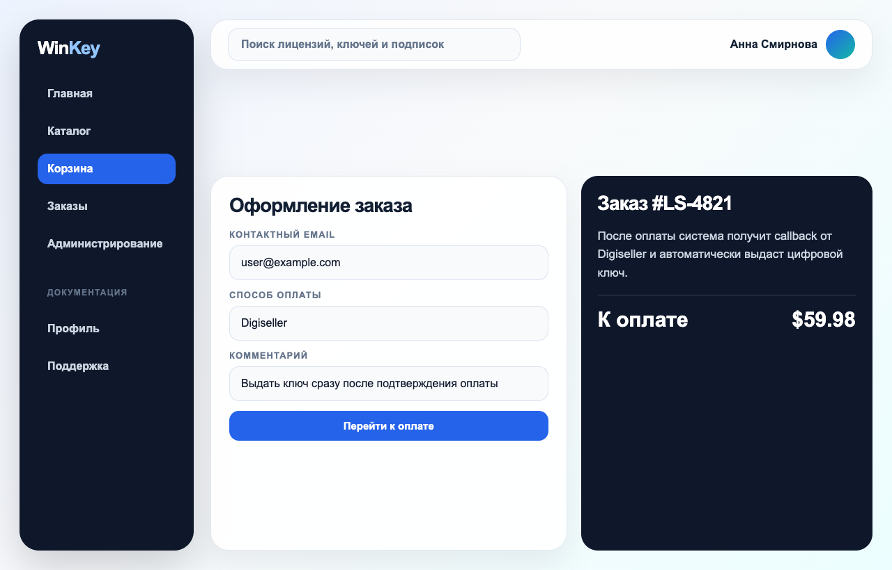

# Checkout

## Назначение раздела

Раздел оформления заказа используется для подтверждения покупки и перехода к
оплате через Digiseller.

## Скриншот интерфейса

## Проверка заказа

Перед оплатой пользователь должен:

1. проверить состав заказа;
2. проверить итоговую сумму;
3. указать email, если он требуется;
4. убедиться, что выбран правильный товар.

## Создание платежа

После подтверждения заказа система создает платежную ссылку. Пользователь
переходит на страницу оплаты Digiseller.

## Оплата через Digiseller

На стороне Digiseller пользователь выполняет оплату выбранным способом. После
завершения оплаты система возвращает пользователя обратно в магазин.

## Результат оплаты

После оплаты возможны варианты:

- платеж успешен, заказ переходит в обработку;
- платеж не выполнен, пользователь возвращается к оформлению;
- подтверждение оплаты задерживается, заказ временно остается в ожидании.

## Возможные проблемы

### Оплата не прошла

Если оплата не прошла, нужно повторить попытку или выбрать другой способ оплаты.

### Пользователь закрыл страницу оплаты

Если страница оплаты закрыта до завершения, заказ может остаться в начальном
статусе.

### Подтверждение задерживается

Если платеж подтверждается не сразу, нужно открыть страницу заказа позднее.

## Результат

После успешной оплаты заказ передается на выдачу цифрового товара.
