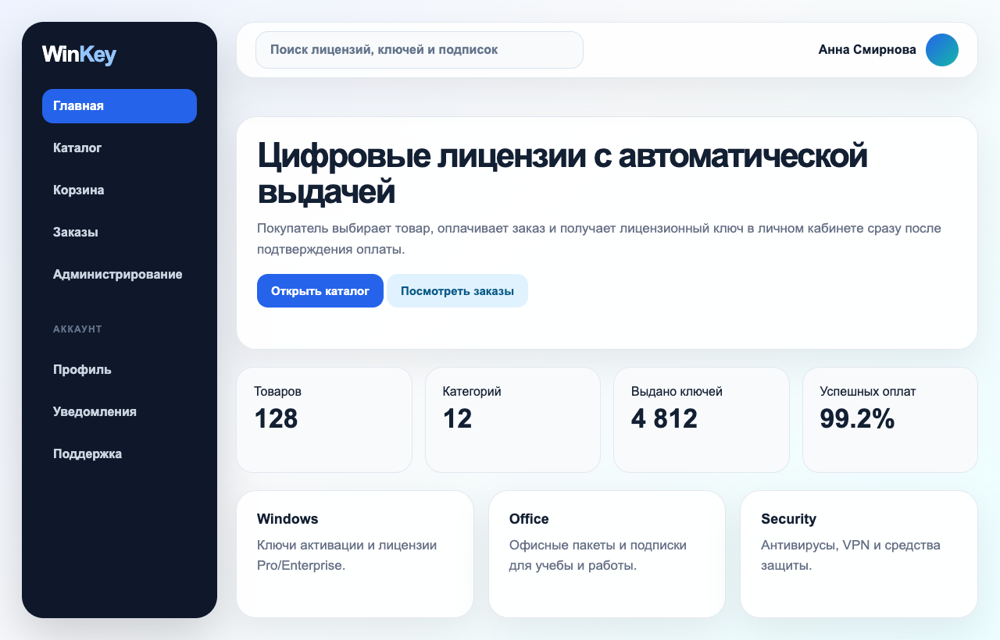

# WinKey Wiki

## Назначение документации

Эта Wiki объясняет, как пользоваться веб-приложением WinKey простыми шагами. Документация написана так, чтобы пользователь не гадал, куда нажимать, какие данные вводить и что делать при ошибке.

WinKey предназначен для покупки цифровых товаров: лицензионных ключей, подписок и электронных продуктов. После оплаты система автоматически выдает ключ на странице заказа.

## Быстрый старт

Если вы впервые открыли WinKey, действуйте так:

1. откройте главную страницу магазина;
2. найдите товар через поиск или каталог;
3. откройте карточку товара и проверьте цену, описание и наличие;
4. добавьте товар в корзину;
5. перейдите в корзину и проверьте состав заказа;
6. нажмите кнопку оформления заказа;
7. оплатите заказ через Digiseller;
8. вернитесь на страницу заказа;
9. скопируйте полученный цифровой ключ.

Внешний вид главной страницы показан на [Рисунке 1](#fig-1).

**Рисунок 1 - Главная страница WinKey с меню, поиском и быстрыми разделами.**

## Основные разделы Wiki

1. [Login-and-Registration](Registration-and-login) - вход, регистрация, SMS-код и проблемы авторизации.
2. [User-Interface](User-interface) - меню, профиль, аватар, уведомления и общие элементы интерфейса.
3. [Product-Catalog](Product-catalog) - поиск товара, фильтры, карточка товара и ограничения.
4. [Cart](Cart) - добавление, изменение количества, удаление и проверка корзины.
5. [Checkout](Checkout) - оформление заказа, email, оплата и возврат после оплаты.
6. [Order-Details](Order-details) - статусы заказа, получение ключа и ошибки выдачи.
7. [Admin-Panel](Admin-panel) - действия администратора с товарами, заказами и выдачей.
8. [Interface-Screenshots](Interface-HTML-CSS) - все рисунки интерфейса в одном месте.

## Правило для пользователя

Если что-то не получилось, сначала проверьте три вещи:

- правильно ли заполнены обязательные поля;
- не превышен ли размер загружаемого файла;
- не открыт ли старый экран после обновления данных.

Если данные вроде бы правильные, обновите страницу и повторите действие один раз. Если ошибка повторилась, сохраните номер заказа или текст ошибки и обратитесь в поддержку.

## Результат работы с системой

После успешной покупки пользователь получает заказ со статусом `DELIVERED`, а цифровой ключ становится доступен на странице заказа.
