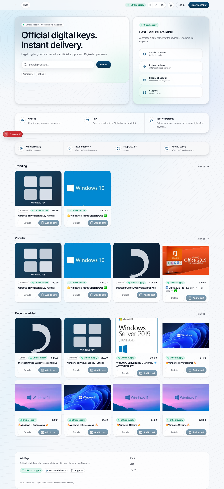
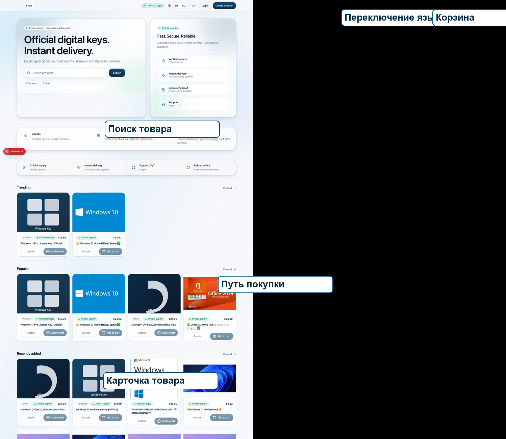

# Legal Store Wiki

`Legal Store` - веб-приложение интернет-магазина цифровых товаров и лицензионных
ключей. Пользователь работает с системой через веб-интерфейс: ищет товар,
открывает карточку, добавляет товар в корзину, оформляет заказ и получает
цифровой товар после оплаты.

## Общий вид интерфейса

## Основные зоны интерфейса

Главная страница содержит верхнее меню, переключатель языка, кнопку корзины,
кнопки входа и регистрации, поисковую строку, блок преимуществ и подборки
товаров. Такой интерфейс позволяет пользователю сразу перейти к покупке без
дополнительных разделов.

## Разделы Wiki

- [Интерфейс пользователя](User-interface.md)
- [Регистрация и вход](Registration-and-login.md)
- [Каталог товаров](Product-catalog.md)
- [Корзина](Cart.md)
- [Оформление заказа](Checkout.md)
- [Просмотр заказа](Order-details.md)
- [Административная панель](Admin-panel.md)
