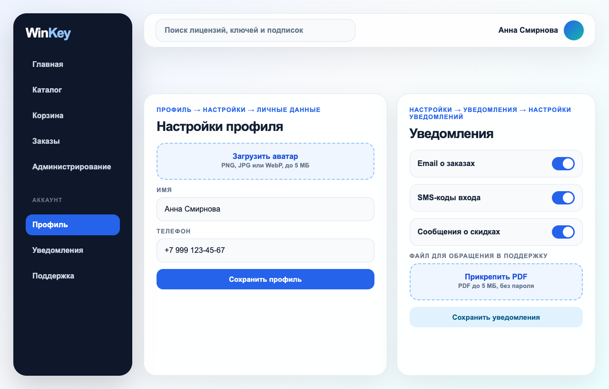

# Interface Screenshots

## Назначение раздела

Этот раздел собирает все рисунки интерфейса WinKey в одном месте. На остальные страницы Wiki можно ссылаться коротко: например, [Рисунок 1](#fig-1), [Рисунок 2](#fig-2) или [Рисунок 8](#fig-8).

## Рисунок 1 - Главный экран

**Рисунок 1 - Главный экран WinKey с меню, поиском и быстрыми блоками.**

## Рисунок 2 - Вход и SMS-код

**Рисунок 2 - Форма входа и SMS-код, где каждая цифра вводится в отдельный квадрат.**

## Рисунок 3 - Каталог товаров

**Рисунок 3 - Каталог товаров с карточками, ценой и кнопкой добавления в корзину.**

## Рисунок 4 - Корзина

**Рисунок 4 - Корзина со списком товаров и итоговой суммой.**

## Рисунок 5 - Оформление заказа

**Рисунок 5 - Форма оформления заказа перед переходом к оплате.**

## Рисунок 6 - Детали заказа

**Рисунок 6 - Страница заказа со статусом и выданными цифровыми ключами.**

## Рисунок 7 - Административная панель

**Рисунок 7 - Административная панель с товарами, метриками и действиями администратора.**

## Рисунок 8 - Профиль и уведомления

**Рисунок 8 - Настройки профиля, загрузка аватара, SMS и email-уведомления.**

## Результат

Пользовательская документация показывает не только текст, но и конкретные экраны, к которым ведут короткие ссылки из инструкций.
