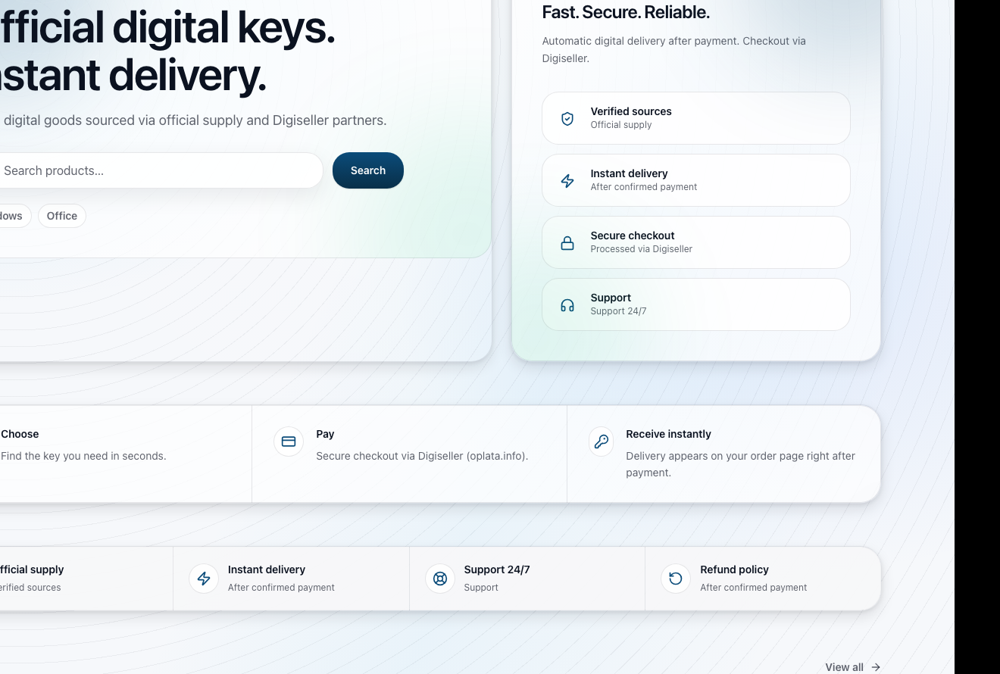
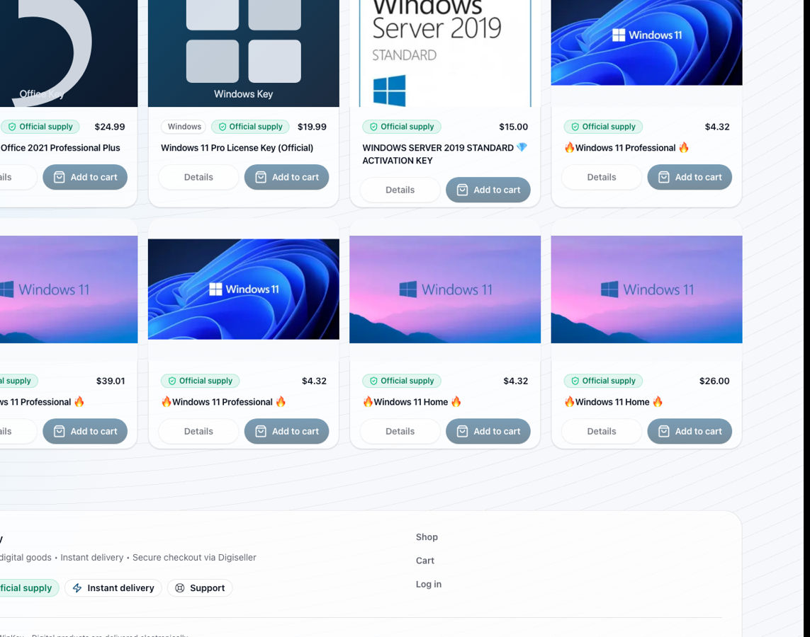

# Каталог товаров

Каталог позволяет просматривать цифровые товары, выполнять поиск и выбирать
подходящий товар.

## Интерфейс каталога

На экране каталога пользователь видит поисковую строку, быстрые категории,
подборки товаров и карточки популярных позиций. Поиск расположен в центральной
части страницы, чтобы пользователь мог сразу ввести название продукта.

## Основные действия

1. Открыть страницу каталога.
2. Использовать поиск по названию.
3. Выбрать категорию.
4. Отсортировать товары по цене, популярности или новизне.
5. Открыть карточку товара для подробного просмотра.

## Карточка товара

В карточке товара отображаются:

- название;
- описание;
- цена;
- изображения;
- платформа;
- издание;
- доступность товара;
- кнопка добавления в корзину.

Кнопка `Details` открывает подробную страницу товара, а кнопка `Add to cart`
добавляет выбранную позицию в корзину.
