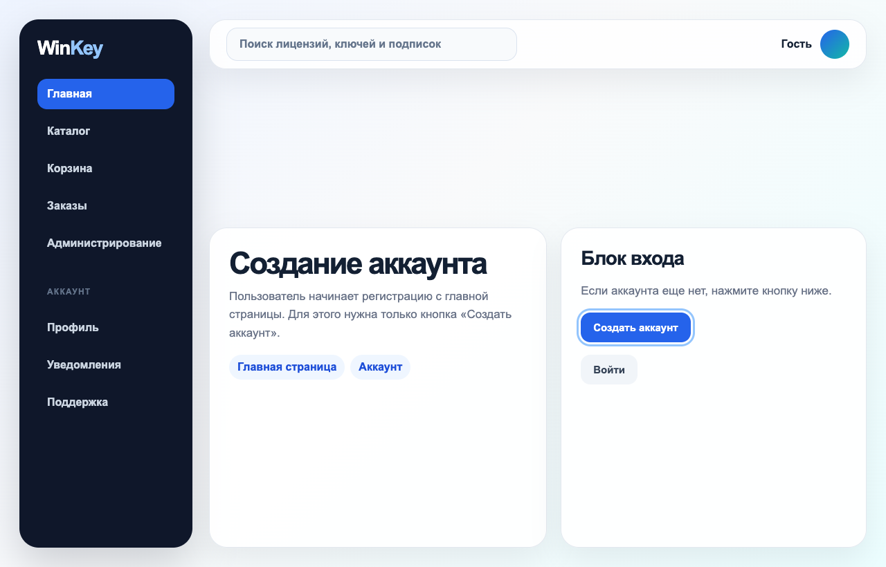
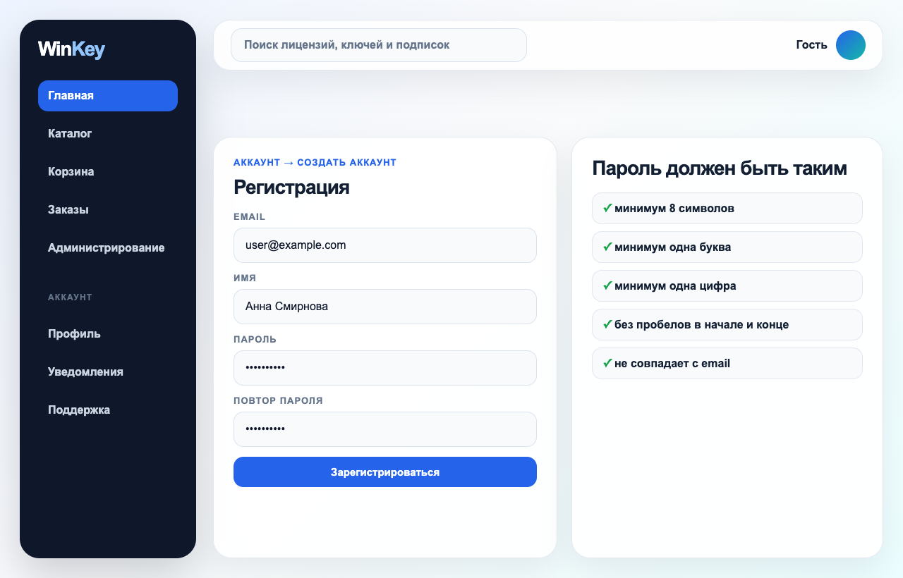
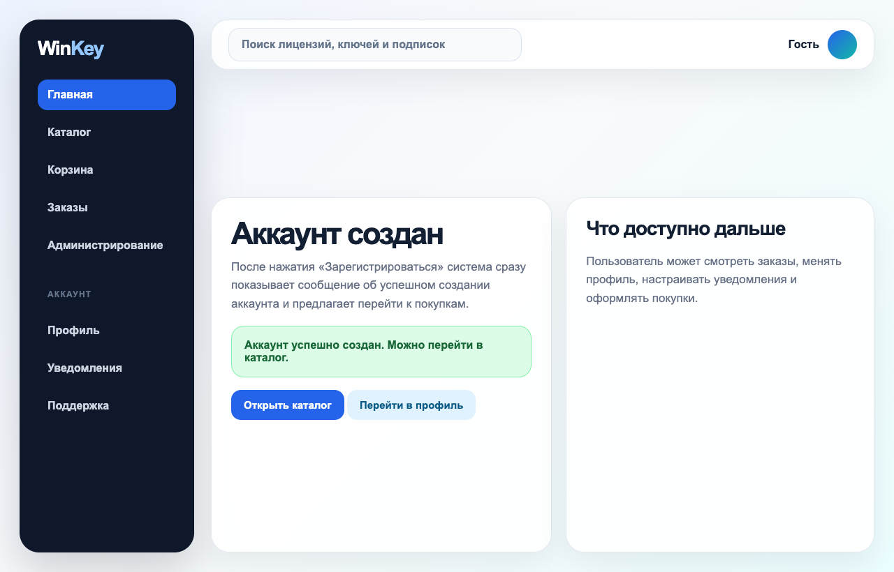

# Login and Registration

## Назначение раздела

Этот раздел объясняет, как создать аккаунт, войти в WinKey и подтвердить вход SMS-кодом. Регистрация нужна, чтобы пользователь мог сохранять заказы, получать ключи, менять профиль и настраивать уведомления.

## Регистрация нового пользователя

Регистрация начинается с главной страницы. Пользователь открывает WinKey и нажимает только кнопку `Создать аккаунт`. Другого варианта в инструкции не используется, чтобы не путать пользователя разными названиями одной и той же функции. Этот шаг показан на [Рисунке 1](#fig-1).

**Рисунок 1 - Переход к созданию аккаунта через кнопку `Создать аккаунт`.**

После нажатия кнопки открывается форма регистрации. В поле `Email` пользователь вводит свой рабочий email, в поле `Имя` указывает имя для профиля, а в поле `Пароль` сразу задает пароль с учетом правил: минимум 8 символов, минимум одна буква, минимум одна цифра, без пробелов в начале и конце, пароль не должен совпадать с email. Если на форме есть поле `Повтор пароля`, в него вводится тот же пароль. Затем пользователь нажимает `Зарегистрироваться`. Форма и правила пароля показаны на [Рисунке 2](#fig-2).

**Рисунок 2 - Форма регистрации с полями email, имя, пароль, повтор пароля и правилами пароля.**

После нажатия `Зарегистрироваться` система сразу показывает сообщение об успешном создании аккаунта. Пользователь может перейти в каталог, открыть профиль или продолжить настройку аккаунта. Экран успешного создания показан на [Рисунке 3](#fig-3).

**Рисунок 3 - Сообщение об успешном создании аккаунта и переход к дальнейшим действиям.**

## Вход в аккаунт

Для входа пользователь открывает страницу входа, вводит email и пароль, затем нажимает `Войти`. Если для аккаунта включена дополнительная защита, система открывает ввод SMS-кода. Код вводится в четыре маленьких поля: одна цифра в одну ячейку. Такой интерфейс нужен, чтобы пользователь видел каждую цифру отдельно и не вводил весь код в одно длинное поле. Экран входа и SMS-кода показан на [Рисунке 4](#fig-4).

**Рисунок 4 - Вход в аккаунт и подтверждение SMS-кодом из четырех отдельных цифр.**

Код состоит из 4 цифр и действует 5 минут. Если код не пришел, повторную отправку можно запросить через 60 секунд. Если код введен неверно несколько раз подряд, вход временно блокируется для защиты аккаунта.

## Восстановление пароля

Если пароль забыт, пользователь открывает страницу входа и нажимает `Забыли пароль?`. После этого он указывает email аккаунта, получает письмо со ссылкой восстановления, открывает ссылку и задает новый пароль по тем же правилам, которые показаны на [Рисунке 2](#fig-2). После смены пароля пользователь возвращается на страницу входа и входит с новым паролем.

## Возможные проблемы

Если система пишет, что email уже используется, новый аккаунт создавать не нужно: пользователь уже зарегистрирован и должен войти или восстановить пароль. Если пароль не принимается, нужно проверить, хватает ли 8 символов, есть ли буква и цифра, нет ли пробелов в начале или конце. Если SMS не приходит, нужно проверить номер телефона в профиле, связь и возможность повторной отправки через 60 секунд. Если аккаунт заблокирован, пользователь обращается в поддержку и указывает email аккаунта.

## Результат

После успешной регистрации или входа пользователь получает доступ к каталогу, корзине, заказам, профилю и настройкам уведомлений.
